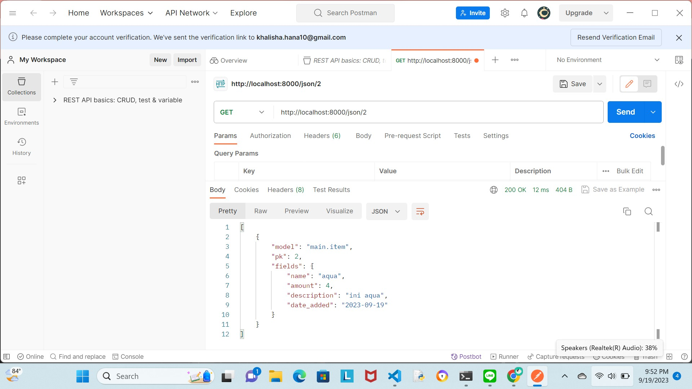

TUGAS 6
- Asynchronous dan synchronous programming merupakan dua pendekatan berbeda dalam programming yang berfungsi melakukan eksekusi kode dengan proses yang berbeda. Asynchronous programming adalah metode dimana suatu kode tidak dijalankan secara berurutan. Pada metode ini jika terdapat suatu request yang gagal, hal tersebut tidak akan mempengaruhi eksekusi request lainnya dan program dapat langsung beralih ke tugas lain tanpa perlu menyelesaikan tugas sebelumnya terlebih dahulu. Dalam asynchronous programming, tugas yang akan ditangani nanti (secara asinkronus) biasanya akan melibatkan pemanggilan metode seperti async dan await. Async digunakan untuk menandai fungsi sebagai fungsi yang dapat mengembalikan nilai secara asinkronus, sedangkan fungsi await digunakan untuk menunggu hasil dari fungsi async. Asynchronous programming biasa diimplementasikan dalam JavaScript untuk melakukan permintaan HTTP, seperti AJAX atau fetch, dan mengambil data dari server tanpa menghentikan eksekusi kode berikutnya. Sementara itu, synchronous programming adalah suatu metode dimana kode akan dieksekusi secara berurutan. Jika ada suatu request yang memerlukan waktu lebih untuk dieksekusi, maka eksekusi kode lainnya akan terblokir dan program harus menunggu request tersebut selesai sebelum melanjutkan proses eksekusi kode.
- Event driven programming adalah suatu pendekatan dalam programming dimana program akan melakukan respons terhadap events yang terjadi, misalnya input yang diberikan oleh user hingga pengisian data di formulir. Event driven programming bekerja dengan menunggu dan menanggapi suatu kejadian atau peristiwa tertentu. Pada tugas kali ini, terdapat beberapa code yang merupakan bentuk dari implementasi event driven programming. Mulai dari code JavaScript, terdapat kode seperti fetch dan .then() yang masing-masing berfungsi untuk menangani request yang terkait dengan respons dari server serta mengeksekusi kode setelah permintaan selesai. Dua fungsionalitas dari kode tersebut termasuk dalam event driven programming dimana perilaku program akan dipicu oleh peristiwa yang terjadi saat proses eksekusi program. Selain pada JavaScript, event driven programming juga diimplementasikan pada code HTML seperti dalam button modal untuk memunculkan pop up tepat ketika button tersebut ditekan.
- Pada AJAX, penerapan asynchronous programming dilakukan sehingga suatu web dapat mengambil atau mengirim data ke server tanpa harus me-refresh seluruh halaman. Hal ini memungkinkan AJAX menerima permintaan secara asinkronus dimana ketika terdapat suatu permintaan yang dikirim ke server, kode JavaScript yang ada akan tetap dieksekusi tanpa perlu menunggu respons dari server. Nantinya, kode tersebut baru akan menanggapi respons ketika respons yang terdapat pada server telah siap. Selain itu dengan menggunakan event driven programming, AJAX juga dapat langsung menambahkan listener untuk menangani event ketika permintaan asinkronus selesai atau terdapat peristiwa yang berkaitan dengan data yang ada (seperti berhasil atau gagalnya permintaan). 
- Fetch API maupun library jquery merupakan dua metode yang dapat berfungsi melakukan permintaan AJAX walaupun dengan cara yang berbeda. Fetch API adalah bagian dari spesifikasi JavaScript yang dirancang untuk meng-handle permintaan asinkronus. API bersifat lebih sederhana dan berfokus pada fetching data sehingga penggunaannya dapat langsung mencakup fungsi dasar untuk membuat permintaan dan mengelola respons. Sementara itu, jquery adalah library JavaScript eksternal yang juga dapat digunakan untuk mendukung AJAX dalam suatu aplikasi web. Untuk menggunakannya, developer harus melakukan pengunduhan library tersebut sehingga dapat menambah beban tambahan pada aplikasi yang sedang dibuat. JQuery menggunakan pendekatan callback-based dalam penanganan permintaan AJAX yang berarti ia akan mendefinisikan fungsi callback yang akan dijalankan setelah permintaan selesai. Walaupun jquery dapat memberi beban tambahan pada aplikasi, umumnya konfigurasi permintaan AJAX dengan jQuery bersifat lebih singkat karena banyak opsi umum yang sudah dikonfigurasi oleh library jQuery. Secara keseluruhan, untuk membangun suatu aplikasi ringan yang modern seperti dalam amta kuliah PBP ini, penggunaan fetch API akan lebih tepat karena sifatnya yang ringan karena sudah menjadi suatu bagian dari JavaScript serta kemampuan melakukan pendekatan promise-based yang memudahkan penanganan operasi secara asinkronus. Namun, jika ingin membuat suatu aplikasi yang nantinya memerlukan banyak fungsi tambahan, jquery bisa menjadi pilihan yang tepat karena kemampuannya untuk mendukung banyak manipulasi DOM, animasi, dan fungsi tambahan.
- Untuk melakukan semua checklist yang tertera pada soal, pertama saya membuat fungsi get_product_json di views.py sehingga program saya dapat menggunakan fetch untuk menampilkan data produk pada HTML. Selanjutnya, saya juga menambahkan path sesuai nama fungsi yang baru saya buat di urls.py. Setelah itu, saya membuat fungsi untuk menambah produk dengan AJAX yang bernama create_product_ajax di views.py dengan mengacu pada beberapa langkah lainnya yang tertera pada tutorial. Saya kemudian kembali melakukan routing di urls.py dan memberi nama path function create_product_ajax dengan /create-ajax/ sebagaimana yang tertera pada tugas ini. Selanjutnya, saya membuat struktur card dengan id yakni product_cards untuk mendukung proses pembuatan cards di JavaScript nanti. Saya juga membuat beberapa fungsi yang sebagian besar mengacu pada tutorial, seperti fungsi getProducts, refreshProducts, dan addProducts. Saya membuat sebuah fungsi tambahan yaitu addProductCard yang berfungsi membuat struktur card ketika saya menambahkan item melalui AJAX. Dengan adanya fungsi ini, saya hanya perlu memanggil fungsi addProductCard di fungsi refreshProducts tanpa perlu kembali membuat struktur card seperti tutorial dimana struktur tabel dibuat secara langsung didalam fungsi refreshProducts. Setelah itu, saya menmabhakn form untuk melakukan penambahan produk yang mengacu pada kode modal yang terdapat pada bootstrap yang tertera pada tutorial. Tentunya, saya melakukan penyesuaian data input pada form tersebut sesuai dengan aplikasi yang saya miliki. Untuk menampilkan modal tersebut, saya juga membuat suatu button yang bernama Tambah Isi Stok by AJAX serta melakukan penyesuaian ukuran button dengan button lainnya yang sudah terlebih dahulu saya miliki. Setelah itu, saya lalu melakukan set up untuk deploy ke server pbp.cs.ui seperti yang tertera pada tutorial 2, melakukan push, dan kemudian melakukan perintah py manage.py collectstatic.

TUGAS 5
- Element selector adalah salah satu dari tiga jenis selector yang ada di CSS, yaitu Element Selector, ID Selector, dan Class Selector. Element selector sendiri adalah selector pada CSS yang dimanfaatkan untuk menargetkan elemen dan mengatur design default elemen HTML. Jenis dari element selector antara lain paragraf (\
), judul (\<h1>, \<h2>), dan daftar item (\<ul>, \<li>). Ketiga jenis element selector tersebut tentunya memiliki fungsi berbeda yang dapat dimanfaatkan dalam membangun sebuah file berbasis HTML dan CSS. Tag \
 berfungsi untuk menampilkan teks konten dengan mengelompokkan teks menjadi satu paragraf atau blok teks. Sementara itu, element seperti \<h1> dan \<h2> berfungsi untuk menampilkan suatu judul dalam bentuk teks pada tampilan web. Semakin besar angka yang terdapat pada tag tersebut, maka teks judul yang dihasilkan akan berukuran semakin kecil (membuat subjudul dengan ukuran lebih kecil). Sementara itu, tag \<ul> dan \<li> merupakan tag Unordered List dan List Item yang masing-masing berfungsi untuk membuat daftar yang tidak berurutan (biasanya ditampilkan dengan simbol) serta menandai setiap elemen dalam daftar yang telah dibuat menggunakan \<ul>. Element selector digunakan ketika kita ingin mengatur letak dan design komponen pada web seperti mengatur gaya dasar teks, margin, serta padding. 
- Tag HTML5 adalah elemen-elemen markup yang digunakan dalam bahasa pemrograman HTML versi terbaru. Tag HTML5 digunakan untuk mengelompokkan, mendefinisikan, dan mengatur konten dalam sebuah halaman web. Tag HTML5 mendukung tag untuk menciptakan struktur pada sebuah web, seperti \<header>, \<nav>, \<main>, \<section>, dan \<footer>. Keempat fitur tersebut masing-masing berfungsi untuk membuat struktur sebuah halaman web yang lebih terstruktur mencakup bagian header, navigation bar, konten utama web (main), section halaman pada web, hingga footer. Selain itu, masih banyak tag lain yang dimiliki HTML5 untuk mendukung pembuatan web, seperti tag \<form> untuk pembuatan formulir; tag \<table>, \<tr>, \<td> untuk pembuatan table; tag \<ul>, \<li>, \<ol> untuk membuat daftar; tag \<a> untuk membuat hyperlink untuk membuat tautan ke web lain.
- Margin dan padding adalah dua bagian dari box model yang dimiliki oleh CSS. Keduanya berperan dalam mengatur ruang di sekitar elemen HTML. Margin sendiri digunakan untuk menciptakan ruang di sekitar elemen. Dengan mengatur padding (top, right, bottom, left) kita dapat mengatur ukuran margin setiap sisi elemen sesuai yang kita inginkan. Margin dapat diakses dengan besaran panjang dalam cm, px, hingga pt ataupun dengan persentase ukuran. Sementara itu, padding digunakan untuk menciptakan ruang di sekitar elemen didalam suatu batas yang ditentukan. Dari segi penulisan saat mengakses besaran padding, syntax yang digunakan kurang lebih sama dengan ketika kita hendak mengatur margin. Letak (value) yang dimiliki padding juga sama dengan yang dimiliki oleh margin yaitu top, bottom, left, dan right. Perbedaan paling mendasar dari margin dan padding adalah posisi diantara keduanya, posisi padding akan berada pada bagian lebih dalam sementara margin akan mencakup pada bagian lebih luar.
- Tailwind dan bootstrap adalah dua framework CSS yang pada saat ini umum digunakan oleh para web developer dalam membangun dan menciptakan design sebuah web. Dari segi pendekatan desain, tailwind menggunakan kerangka kerja CSS utility-first yang berarti seorang developer harus membuat suatu desain dari nol menggunakan berbagai kelas utilitas. Sementara, bootstrap telah memiliki code yang berisi berbagai komponen desain web yang dapat langsung digunakan oleh developer tanpa perlu menulis suatu kode dari awal. Dari dua pendekatan desain ini, tailwind memiliki kelebihan yakni lebih fleksibel dalam membangun desain sesuai kebutuhan dibanding dengan bootstrap. Meskipun desain bawaan yang dimiliki bootstrap amsih dapat disesuaikan dengan keinginan developer, namun tentunya akan banyak batasan yang dialami saat seseorang hendalk memodifikasi desain bawaan dari bootstrap. Tailwind cocok digunakan untuk membangun proyek yang membutuhkan desain khusus dalam pembuatan fungsionalitas suatu web, sementara bootstrap coock digunakan untuk proyek sederhana serta pembelajaran awal dalam mempelajari design serta web development.
- Dalam membuat design web yang saya punya dengan memanfaatkan framework CSS pertama saya menambahkan bootstrap ke dalam program yang saya, tepatnya pada base.html sebagaimana yang dijelaskan dalam tutorial 4. Setelah bootstrap sudah berhasil ditambahkan pada program yang saya miliki, saya kemudian melakukan modifikasi mulai dari laman login sebagaimana pada cecklist di tugas ini. Saya memodifikasi laman login dengan membuat suatu card login. Fungsionalitas mengenai input yang terdapat didalam card tersebut sama dengan input yang diminta oleh login.html sebelumnya. Dlam hal ini, saya hanya mengubah design laman login tanpa mengubah fungsionalitas dari input ataupun proses autentikasi yang telah dibuat dari tugas-tugas sebelumnya. Hal yang sama juga saya lakukan pada laman register, saya mengubah design register menjadi berbentuk card dimana pengguna dapat mendaftarkan diri di card tersebut sebelum mengakses halaman utama web. Setelah card sudah berhasil dibuat dan penempatannya telah sesuai, saya kemudain memberi customisasi warna pada card tersebut dengan menambahkan style dari css pada laman login.html serta register.html untuk memberi warna pada card yang saya punya. Setelah itu, saya melakukan customisasi halaman utama yang berisi daftar inventori yang sebelumnya dimuat dalam tabel. Pertama, pada halaman ini saya menambahkan navbar dengan memanfaatkan bootstrap. Saya melakukan modifikasi pada warna serta tampilan navbar yang ada dengan menyesuaikan pada warna halaman utama saya secara keseluruhan nantinya. Dalam mengubah warna navbar dari yang telah diberikan pada default dari bootstrap ini, saya memanfaatkan style dari CSS sebagaimana yang saya lakukan saat memodifikasi warna card pada laman login dan register. Setelah itu pada bagian tabel inventori, saya melakukan modifikasi penempatan item yang semula dalam bentuk tabel menjadi dalam bentuk card. Dalam pembuatan card ini, saya juga memanfaatkan CSS bawaan dari bootstrap untuk memudahkan pengerjaan saya. Saya meng-set tabel sebanyak 3 secara horizontal pada tampilan web saya. Jika terdapat penambahan komponen, untuk memastikan card baru yang dibuat akan berada di tengah halaman, saya menggunakan metode mx-auto agar posisi card bisa menyesuaikan dan berada di bagian tengah mengikuti card yang ada diatasnya. Setelah melakukan custom pada laman main, saya juga melakukan sedikit custom pada laman saat pengguna hendak menambah item yang akan disimpan ke dalam inventori. Terakhir, saya menambahkan navbar berisi judul aplikasi yang saya punya pada laman login, register, serta tambah item.

TUGAS 4
- Django UserCreationForm merupakan impor fomulir bawaan Django yang dapat membantu developer dalam membuat suatu formulir pendaftaran dalam aplikasi web. Nantinya, pengguna baru yang mendaftar ke dalam formulir tersebut dapat dengan mudah mendaftarkan diri langsung di situs web tanpa harus menulis kode untuk melakukan pendaftaran. Formulir ini biasanya digunakan dalam suatu web yang memiliki sistem otentikasi yang memungkinkan pengguna untuk mendaftar dan mengelola akun mereka di situs aplikasi web. Django UserCreationForm menawarkan beberapa kelebihan, antara lain membuat suatu formulir berbasis web mudah diakses oleh pengguna, menciptakan hubungan integrasi yang kuat dengan sistem otentikasi yang dimiliki Django, hingga memiliki kemampuan melakukan proses validasi data pengguna secara otomatis. Akan tetapi, Django UserCreationForm tidak terlepas dari beberapa kekurangan, antara lain tidak tersedianya fitur pendaftaran yang lebih kompleks sehingga seorang developer harus menambahkan fitur tersebut secara manual jika menginginkan formulir pendaftaran yang lebih kompleks serta mendesain tampilan web secara mandiri. Hal ini tidak terlepas karena Django UserCreationForm hanya memiliki tampilan web yang sederhana.
- Autentikasi adalah proses verifikasi pengguna dengan melakukan pengecekan terhadap kredensial yang dimiliki pengguna. Jika kredensial yang dilakukan saat pengecekan sesuai dengan data pengguna, mka apengguna tersebut dapat memiliki akses untuk login ke dalam suatu web/aplikasi. Contoh dari proses autentikasi, antara lain Single Factor authentication(password), 2-Factor Authentication (password yang mengharuskan konfirmasi ke akun lain seperti email atau nomor telepon), hingga Multi-Factor Authentication (proses autentikasi lebih kompleks yang biasanya melibatkan ciri fisik pengguna, seperti sidik jari atau identifikasi wajah). Sementara itu, otorisasi adalah proses yang memverifikasi bahwa suatu pengguna diizinkan untuk memiliki akses ke dalam suatu aplikasi atau melakukan suatu tindakan tertentu (misalnya menginput data dengan akun bersesuaian di dalam web) berdasarkan ketentuan yang ada. Contoh dari otorisasi ini adalah ketika mencoba mengakses file seseorang namun terkunci akibat orang tersebut tidak menambahkan kita ke dalam daftar pengakses yang diizinkan. Dalam kasus ini, kita tidak ter-otorisasi untuk mengakses atau bahkan sekadar melihat akun orang tersebut. Autentikasi dan otorisasi merupakan dua proses yang penting dalam pengembangan web. Kedua proses ini memiliki peran krusial dalam menjaga keamanan dan privasi data seseorang. Kombinasi antara autentikasi dan otorisasi membantu menciptakan lingkungan keamanan yang kuat dalam sebuah aplikasi maupun sistem dengan memastikan bahwa hanya pengguna sah dengan hak akses sesuai yang dapat mengakses sebuah aplikasi atau sistem.
- Dalam konteks aplikasi web, cookies adalah salah satu cara melakukan holding state dengan memanfaatkan session ID yang disimpan. Session ID ini nantinya akan disimpan dalam bentuk cookies pada komputer yang bersangkutan. Session ID sendiri merupakan suatu "token" yang menyimpan informasi seperti username, nama, serta password dari klien. Cookies digunakan untuk menyimpan informasi yang dapat diakses oleh server atau aplikasi web saat pengguna kembali ke situs tersebut. Django sendiri memanfaatkan cookies untuk hal serupa. Untuk memastikan cookies dapat dimanfaatkan oleh Django, sebelumnya perlu dipastikan beberapa tahapan telah terpenuhi, di antaranya memastikan terdapat pesan "django.contrib.sessions.middleware.SessionMiddleware" di dalam "MIDDLEWARE" yang terdapat pada berkas setting.py. Django sendiri menggunakan cookies dengan melalui mekanisme session framework dimana Django dapat menyimpan dan mengambil data sesi pengguna dengan mudah menggunakan cookies. 
- Secara default, pada aplikasi web, penggunaan cookies merupakan suatu hal yang cukup lumrah dan aman bagi pengguna. Umumnya, cookies digunakan untuk menyimpan data dalam sesi pengguna serta mengidentifikasi pengguna. Akan tetapi, terdapat beberapa risiko yang dapat terjadi akibat pemakaian cookies. Beberapa contoh dari risiko tersebut, antara lain terjadinya serangan Cross-Site Scripting (XSS) dimana penyerang akan memasukkan kode berbahaya ke dalam cookies yang akan dieksekusi oleh pengguna lain saat mereka mengakses situs tersebut, peretasan sesi dimana peretas mengambil alih sesi pengguna yang sah sehingga mengakibatkan akses yang tidak sah masuk ke dalam akun pengguna tersebut, serta penyadapan yang dapat berujung pada pencurian data sensitif pengguna.  
- Pertama, saya melakukan import UserCreationForm serta messages agar nantinya pengguna dapat dengan mudah melakukan pendaftaran saat mengakses formulir ini melalui web serta developer dapat dengan mudah memunculkan pesan pada halaman web. Selanjutnya, saya menambahkan kode dengan method post pada fungsi register serta mengimplementasikan UserCreationForm pada variabel form dan messages yang tadi sudah diimpor pada fungsi tersebut sehingga program dapat menampilkan pesan kepada pengguna setelah melakukan suatu aksi. Kemudian, saya membuat file baru bernama register.html pada folder templates yang terdapat di main sebagai file yang nantinya akan menampilkan halaman ketika pengguna melakukan register. Selanjutnya, saya melakukan update pada urls.py dengan menambahkan subdirektori serta path register. Setelah selesai membuat register, saya kemudian membuat fungsi agar pengguna dapat melakukan login dengan terlebih dahulu melakukan import authenticate dan login. Kedua import tersebut bertujuan agar program dapat melakukan autentikasi dan login jika autentikasi berhasil. Kemudian, saya menambahkan fungsi login_user pada views.py yang didalamnya terdapat kode sehingga program dapat melakukan autentikasi berdasarkan username dan password yang diterima dari permintaan (request) yang dikirim oleh pengguna saat login. Sebagaimana langkah sebelumnya saat membuat laman register, saya kemudian membuat suatu file bernama login.html di folder main/templates serta melakukan update subdirektori serta path di urls.py sehingga pengguna dapat melakukan login pada page tersebut. Setelah fungsi login, saya kemudian membuat fungsi logout_user pada views.py yang berfungsi menghapus sesi pengguna serta mengarahkan pengguna ke halaman login ketika nantinya pengguna menekan tombol logout. Setelah itu, saya membuat melakukan modifikasi pada file main.html untuk membuat tombol logout dengan fungsi yang telah disebutkan diatas. Setelah itu agar tombol dapat berfungsi, seperti langkah sebelumnya saya melakukan update subdirektori serta path pada urls.py. Setelah program saya sudah dapat melakukan login, logout, dan register akun pengguna, saya kemudian menambahkan kode pada fungsi show_main sehingga web yang saya ounya dapat terestriksi (halaman main hanya dapat diakses oleh pengguna yang sudah login (terautentikasi)). Setelah semua langkah tersebut telah berfungsi dengan baik, saya kemudian menambahkan cookies pada web saya dengan menambahkan data last login dan menampilkannya ke halaman main. Penambahan cookies ini dilakukan dengan melakukan modifikasi pada fungsi login_user dengan menambahkan `response.setcookie('last_login', str(datetime.datetime.now())) yang berfungsi untuk membuat _cookie last_login dan menambahkannya ke dalam response. Kemudian, pada fungsi show_main juga ditambahkan potongan kode 'last_login': request.COOKIES['last_login'] pada variabel context yang berfungsi menambahkan informasi cookie last_login dan menampilkan pesan tersebut pada halaman main. Setelah itu, fungsi logout_user juga mengalami sedikit modifikasi dengan menambahkan kode response.delete_cookie('last_login') berfungsi untuk menghapus cookie last_login saat pengguna melakukan logout. Kemudian, untuk menampilkan pesan last login, saya melakukan pemanggilan variabel last_login di dalam file main.html. Setelah langkah penambahan cookies sudah selesai, saya kemudian membuat dua akun pengguna yang masing-masing berisi tiga dummy data pada web saya sebagaimana yang tertera pada checklist tugas ini. Setelah berhasil membuat dua akun berbeda, saya kemudian melanjutkan pembuatan aplikasi yang saya punya dengan menghubungkan model Item dengan User. Untuk melakukan langkah ini, pertama saya melakukan import User pada models.py serta menambahkan variabel user pada class Item yang didalamnya terdapat method ForeignKey. ForeignKey sendiri digunakan untuk mendefinisikan many-to-one relationship dimana banyak item dapat terkait dengan satu pengguna tertentu. Selanjutnya, juga dilakukan modifikasi pada class create_file di views.py dengan menambahkan commit=False pada product.save agar Django tidak langsung menyimpan objek yang telah dibuat dari form ke database. Selain itu, fungsi show_main juga mengalami sedikit modifikasi pada variabel products serta name sehingga nantinya variabel name tersebut dapat berisi username yang diinput oleh pengguna. Setelah semua langkah selesai, selanjutnya dilakukan migrations agar semua perubahan yang telah dilakukan pada models dapat ter-update. Setelah semua langkah dan fungsionalitas web yang tertera pada checklist sudah dapat berjalan dengan baik, saya kemudian menambahkan beberapa fitur yang dituliskan pada bonus, yaitu fitur untuk menambah/mengurangi jumlah item serta fitur untuk menghapus item dari tabel. Pertama, saya membuat fungsi tambah_amount pada views.py yang nantinya berfungsi untuk menambah jumlah item pada tabel sebanyak 1 ketika tombol "Tambah Amount" ditekan. Pada fungsi ini, selain parameter request, saya juga menambahkan parameter id sehingga nantinya pengguna dapat menambahkan jumlah item sesuai dengan id yang bersesuaian. Saya juga memanfaatkan fungsi get_object_or_404 untuk mencegah error saat hendak menambah/menguarangi amount dari database. Kemudian, saya menambahkan fungsi tambah_amount yang saya punya ke dalam subdirektori serta path yang terdapat di urls.py. Setelah itu, saya kemudian langsung memodifikasi tabel yang ada di main.html untuk membuat kolom baru yang akan berisi tombol "Tambah Amount" pada setiap item yang saya punya. Setelah memastikan tombol tersebut sudah berfungsi dengan baik, saya kemudian melakukan langkah yang sama untuk membuat tombol lain bernama "Kurangi Amount" yang nantinya berfungsi untuk mengurangi jumlah item sebanyak 1 ketika tombol tersebut ditekan. Perbedaan dari fungsi kurangi_amount dengan fungsi tambah_amount hanya terdapat pada line product.amount -= 1 yang saya letakkan didalam indentasi jika product.amount bernilai lebih dari 0 untuk memastikan pengurangan produk akan berhenti jika jumlah item telah bernilai 0. Setelah tombol tambah dan kurangi amount sudah dapat berfungsi dengan baik, saya kemudian membuat fitur yang dapat menghapus suatu item dari tabel inventori. Pertama, saya membuat fungsi delete_item pada views.py yang juga berisi parameter request dan id. Pada fungsi ini saya menggunakan kondisi request.method == "POST" untuk memastikan eksekusi penghapusan item hanya akan dilakukan jika dilakukan method post. Setelah fungsi delete_amount selesai dibuat, saya lalu menambahkan subdirektori serta path delete pada urls.py. Setelah itu, saya kemudian menuju main.html untuk membuat tombol "Hapus Produk" yang akan berfungsi menghapus item dari tabel di setiap item yang terdapat pada tabel. Setelah ketiga tombol tambahan yang dibuat, yaitu "Tambah Amount", "Kurangi Amount", dan "Hapus Produk" sudah dapat berfungsi dengan baik, saya kemudian membuat header untuk ketiga tombol tersebut yang bernama "Fitur". Saya memanfaatkan colspan="3" agar header tersebut dapat berada tepat di tengah ketiga tombol. Saya juga melakukan modifikasi pada tabel dengan menambahkan border pada bagian pinggir tabel. Kemudian, saya juga menambahkan sedikit desain pada laman main dengan menambahkan warna background dan tabel dengan style, serta menambahkan warna pada tombol-tombol fitur yang ada pada tabel. 

TUGAS 3
- Apa perbedaan antara form POST dan form GET dalam Django?  
Jawab: form POST digunakan untuk request yang dapat digunakan untuk membuat perubahan pada sistem (perubahan pada database). Form POST digunakan untuk mengembalikan login form Django di mana browser menggabungkan data formulir, mengkodekannya untuk transmisi, mengirimkannya ke server, dan kemudian menerima kembali responsnya; form GET digunakan untuk menggabungkan data yang dikirim ke dalam string kemudian menggunakannya untuk membuat URL yang nantinya berisi berisi alamat, kunci, serta nilai data. Form GET sebaiknya hanya digunakan untuk request yang tidak mempengaruhi keadaan sistem, seperti formulir pencarian web yang dapat diwakili dengan URL.
- Apa perbedaan utama antara XML, JSON, dan HTML dalam konteks pengiriman data?  
Jawab: XML merupakan sebuah markup language yang didesain untuk membawa data (bukan menyimpan data). XML dapat membuat sandi kode dalam format yang dapat dibaca oleh manusia dan mesin. Dalam penyajiannya, XML menggunakan format tag structure untuk menampilkan item setiap data; JSON merupakan sebuah lightweight data-interchange format dengan basis JavaScript. JSON merepresentasikan data suatu program dalam bentuk objek serta menyimpannya dalam bentuk key dan value; HTML merupakan sebuah markup language yang secara umum digunakan untuk membuat konten dan tampilan sebuah web. HTML memungkinkan developer membuat struktur bagian, paragraf, dan tautan menggunakan elemen HTML (blok penyusun halaman web) seperti tag dan atribut.
- Mengapa JSON sering digunakan dalam pertukaran data antara aplikasi web modern?  
Jawab: JSON sering digunakan dalam pertukaran data antara aplikasi web modern karena ia menawarkan fleksibilitas, kesederhanaan, dan efisiensi bagi developer dalam mengoperasikannya. Tidak seperti XML yang mengharuskan developer untuk menentukan tipe data di setiap node, JSON hanya megharuskan developer untuk menentukan tipe data pada tingkat paling atas. Selain itu, karena JSON merepresentasikan data dalam bentuk objek, JSON menjadi lebih mudah untuk dibaca dibanding dengan XML. Selain itu, JSON juga mudah untuk digunakan dalam melakukan komunikasi antara berbagai komponen aplikasi web modern, termasuk antara klien (browser) dan server, serta dalam pertukaran data antara layanan web (API)
- Jelaskan bagaimana cara kamu mengimplementasikan checklist di atas secara step-by-step  
Jawab: Sebelum mulai membuat input form, terlebih dahulu saya melakukan routing serta mengimplementasikan skeleton dengan membuat folder templates di root folder yang berisi file base.html serta menambahkan BASE_DIR pada settings.py agar kode pada base.html terdeteksi sebagai template dari app ini. Selanjutnya, saya juga membuat modifikasi pada main.html yang menandaan bahwa kode tersebut menggunakan base.html sebagai template utama. Kemudian, saya membuat file forms.py yang berfungsi membuat struktur form yang akan berisi input objek model. Sebagaimana model yang telah saya buat sebelumnya, forms.py yang saya buat memiliki tiga fields, yaitu "name", "amount", dan "description". Saya juga melakukan modifikasi dengan mengubah Product menjadi Item sesuai dengan nama model yang saya punya sebelumnya. Setelah menambahkan beberapa import yang akan digunakan didalam program, saya membuat fungsi baru bernama create_product pada file views.py serta memodifikasi fungsi show_main dengan membuat variabel products untuk mengambil semua object item dari database. Selanjutnya, saya menambahkan nama fungsi baru yang sudah dibuat ke dalam file urls.py pada main serta menambahkan path url dengan nama fungsi yang bersesuaian. Selanjutnya, saya membuat file create_product.html pada folder templates yang ada di main untuk menginisiasi input product dalam bentuk table. Selanjutnya, pada main.html juga ditambahkan  untuk menampilkan data produk dalam bentuk table serta tombol "Tambah Isi Stok" yang akan redirect ke halaman form. Kemudian agar dapat melihat objek dalam bentuk HTML, XML, JSON, XML by ID, dan JSON by ID, saya menambahkan empat fungsi tambahan, yaitu show_xml, show_json, show_xml_by_id, dan show_json_by_id. Sementara itu, tampilan data dalam format html sudah di cover dalam fungsi show_main sehingga tidak perlu lagi dibuat fungsi bernama show_html. Untuk melihat objek dalam kelima format tersebut, saya memanfaatkan postman dengan terlebih dahulu mengaktifkan runserver pada virtual environment sehingga saya dapat melihat tampilan objek dalam lima format tersebut. Setelah semua program hingga tampilan melalui postman sudah berjalan sebagaimana seharusnya, saya kemudian menambahkan counter untuk men-detect jumlah item yang disimpan pada tabel dengan menambahkan variabel product_count dengan method count yang berfungsi untuk menghitung jumlah produk pada file view.py serta menambahkan variabel tersebut ke dalam context. Kemudian, saya menambahkan variabel product_count pada file main.html sehingga jumlah produk yang terdapat di tabel dapat dilihat oleh user.
- Tampilan HTML

- Tampilan XML

- Tampilan JSON

- Tampilan XML by ID

- Tampilan JSON by ID
  
=======================================

TUGAS 2
- Jelaskan bagaimana cara kamu mengimplementasikan checklist di atas secara step-by-step (bukan hanya sekadar mengikuti tutorial).  
Jawab: Pertama, saya membuat direktori bernama stok_tokoku yang digunakan sebagai folder utama dalam membangun web ini. Untuk membuat sebuah proyek Django baru sebagaimana pada checklist soal, tentunya saya harus mengaktifkan virtual environment untuk memudahkan proses pengerjaan saya. Setelah berhasil memastikan virtual environment saya berhasil diaktifkan, langkah selanjutnya yang cukup krusial yakni membuat file requirement.txt untuk membuat dependencies yang diperlukan dalam proses aktivasi proyek Django. Dua langkah selanjutnya yang tidak boleh terlewat yakni memasang dependencies tersebut dengan menjalankan perintah pip install -r requirements.txt dan membuat proyek Django dengan perintah django-admin startproject stok_tokoku ., dalam melakukan rangkaian proses ini hingga menjalankan server, saya mengacu pada command yang dijelaskan pada tutorial untuk membantu dan memastikan pekerjaan yang saya lakukan sudah sesuai dan tidak terdapat suatu langkah yang terlewat dalam proses pembuatan proyek Django saya. Setelah memastikan proyek Django telah berhasil dibuat, saya kemudian membuat repository baru pada github serta melakukan inisiasi repo tersebut. Setelah menambahkan file .gitignore serta README.md, saya memutuskan untuk melakukan git add, commit, dan push ke repo yang telah saya buat untuk setidaknya menyimpan progres pekerjaan yang telah saya lakukan. Setelah semua file yang telah saya buat sudah berada di repo saya sebagaimana semestinya, dengan diawali dengan mengaktifkan virtual environment, saya membuat serta mendaftarkan aplikasi main pada proyek saya. Tidak lupa, saya menambahkan folder templates pada main sekaligus menambahkan file main.html sebagai wadah untuk membangun tampilan website saya. Setelah memastikan tidak ada langkah yang terlewat dalam proses ini, saya melakukan modifikasi pada models.py yang ada di main sesuai dengan ketentuan yang diberikan pada tugas 2. Setelah models.py telah sesuai dengan yang diinginkan oleh soal, saya melakukan migrasi untuk mengubah struktur tabel basis data sesuai dengan perubahan model yang telah saya definisikan. Tidak hanya melakukan modifikasi pada models.py, saya juga melakukan beberapa modifikasi serta tambahan pada views.py serta memsatikan sudah terdapat deklarasi fungsi serta perintah render yang berfungsi untuk mengintegrasikan komponen MVT pada proyek saya. Tidak hanya itu, tentunya saya juga melakukan memodifikasi main.html sehingga saya dapat membuat tampilan web sesuai yang saya inginkan. Setelah semua proses serta tampilan web kira-kira sudah sesuai dengan keinginan saya, saya kemudian melakukan routing agar proyek yang saya buat dapat dijalankan. Setelah semua proses selesai, saya kemudian melakukan git add, commit, dan push dan kemudian melakuan deployment ke Adaptable.
- Buatlah bagan yang berisi request client ke web aplikasi berbasis Django beserta responnya dan jelaskan pada bagan tersebut kaitan antara urls.py, views.py, models.py, dan berkas html.  
Jawab:

Setelah membuat suatu proyek Django, request client pertama kali akan diterima oleh urls.py. Selanjutnya, urls.py akan mendefinisikan pola URL dan mengarahkan request client ke fungsi view yang sesuai, dalam hal ini mengarahkan ke views.py. Di dalam views.py, terdapat beberapa kode yang akan mengatur jalannya aplikasi serta berinteraksi dengan model untuk mengambil atau memanipulasi data yang dibutuhkan untuk merender halaman HTML yang akan dikirimkan ke client. Kemudian, views.py dapat berinteraksi dengan models.py untuk melakukan pengambilan atau penyimpanan data ke database. Setelah melakukan operasi yang dibutuhkan, view akan merender main.html yang didalamnya terdapat variabel-variabel yang diisi dengan data yang diberikan oleh view. Setelah template (dalam hal ini main.html) berhasil di-render, isi dari file html tersebut kemudian akan diteruskan kembali ke client melalui web browser. Untuk ilustrasi bagan yang lebih lengkap dapat dilihat pada [LINK](Django-work-flow.jpg) berikut.
- Jelaskan mengapa kita menggunakan virtual environment? Apakah kita tetap dapat membuat aplikasi web berbasis Django tanpa menggunakan virtual environment?  
Jawab: Virtual environment digunakan untuk mengisolasi package serta dependencies dari aplikasi sehingga tidak bertabrakan dengan versi lain yang ada pada komputer. Fungsi utama virtual environment yakni memungkinkan isolasi dependensi yang memiliki versi Python berbeda pada setiap proyek yang dikerjakan. Hal ini membantu mencegah konflik dan masalah dependensi yang mungkin terjadi ketika dua proyek membutuhkan versi yang berbeda dari paket yang sama. Selain itu, Virtual environment membuat suatu proyek lebih mudah dibagikan bersama orang lain. Karena semua dependensi proyek disimpan dalam lingkungan terisolasi, orang lain dapat membuat lingkungan yang sama untuk menjalankan proyek yang sama tanpa khawatir terjadi konflik dengan paket lain di sistem mereka. Akan tetapi, kita dapat membuat aplikasi web berbasis Django tanpa menggunakan virtual environment dengan konsekuensi lebih sulit untuk mengelola dependensi, sulit jika perlu menggunakan versi Python berbeda dalam suatu proyek, hingga sulit untuk membuat proyek bersama orang lain. Oleh karena itu, untuk menjaga kebersihan, isolasi, dan manajemen dependensi yang lebih baik, sangat dianjurkan untuk menggunakan virtual environment dalam membuat aplikasi web berbasis Django.
- Jelaskan apakah itu MVC, MVT, MVVM dan perbedaan dari ketiganya  
Jawab: MVC, MVT, MVVM adalah tiga konsep arsitektur perangkat lunak yang digunakan dalam pengembangan aplikasi berbasis web. MVC (Model View Controller) bertangung jawab terhadap tampilan (view) serta mengatur alur kontrol (controller). MVC bertanggung jawab untuk mengambil, menyimpan, dan memproses data; menampilkan data dari Model dan menyediakan interface bagi pengguna untuk berinteraksi dengan aplikasi; menangani input pengguna dan memperbarui Model dan Tampilan yang sesuai. Jika dalam mengembangkan aplikasi berbasis user interface biasanya digunakan MVC, pada aplikasi berbasis Django digunakan MVT (Model View Template). MVT merupakan konsep yang memungkinkan pengembang web untuk mengorganisasi dan mengelola kode dengan lebih terstruktur. Sementara itu, MVVM (Model View-View Model) merupakan konsep yang memungkinkan pengikatan data dua arah, yang memudahkan pemutakhiran otomatis tampilan ketika data pada model berubah. Karena alasan tersebut, MVVM biasanya digunakan untuk membangun suatu aplikasi yang membutuhkan update berkala seperti aplikasi pada android atau ios. Perbedaan utama antara ketiganya yakni dalam cara mereka mengorganisasi dan memisahkan komponen-komponen utama dalam suatu proyek/aplikasi. Untuk MVC dan MVT, perbedaan utama terletak pada bagian controller dimana pada MVT Django mengganti controller dengan Template yang nantinya berisi sebuah file HTML. Sementara itu, MVVM menekankan pengikatan data dua arah melalui ViewModel untuk memfasilitasi pengembangan aplikasi yang lebih dinamis serta membuat suatu aplikasi lebih mudah dipelihara dan dikembangkan tanpa perlu menulis kode baru.