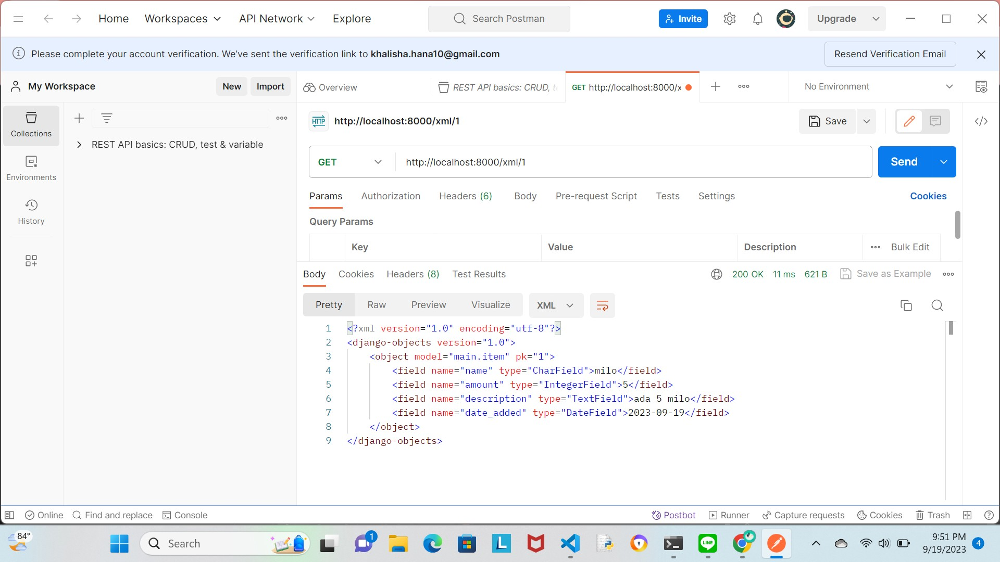

TUGAS 3
- Apa perbedaan antara form POST dan form GET dalam Django?  
Jawab: form POST digunakan untuk request yang dapat digunakan untuk membuat perubahan pada sistem (perubahan pada database). Form POST digunakan untuk mengembalikan login form Django di mana browser menggabungkan data formulir, mengkodekannya untuk transmisi, mengirimkannya ke server, dan kemudian menerima kembali responsnya; form GET digunakan untuk menggabungkan data yang dikirim ke dalam string kemudian menggunakannya untuk membuat URL yang nantinya berisi berisi alamat, kunci, serta nilai data. Form GET sebaiknya hanya digunakan untuk request yang tidak mempengaruhi keadaan sistem, seperti formulir pencarian web yang dapat diwakili dengan URL.
- Apa perbedaan utama antara XML, JSON, dan HTML dalam konteks pengiriman data?  
Jawab: XML merupakan sebuah markup language yang didesain untuk membawa data (bukan menyimpan data). XML dapat membuat sandi kode dalam format yang dapat dibaca oleh manusia dan mesin. Dalam penyajiannya, XML menggunakan format tag structure untuk menampilkan item setiap data; JSON merupakan sebuah lightweight data-interchange format dengan basis JavaScript. JSON merepresentasikan data suatu program dalam bentuk objek serta menyimpannya dalam bentuk key dan value; HTML merupakan sebuah markup language yang secara umum digunakan untuk membuat konten dan tampilan sebuah web. HTML memungkinkan developer membuat struktur bagian, paragraf, dan tautan menggunakan elemen HTML (blok penyusun halaman web) seperti tag dan atribut.
- Mengapa JSON sering digunakan dalam pertukaran data antara aplikasi web modern?  
Jawab: JSON sering digunakan dalam pertukaran data antara aplikasi web modern karena ia menawarkan fleksibilitas, kesederhanaan, dan efisiensi bagi developer dalam mengoperasikannya. Tidak seperti XML yang mengharuskan developer untuk menentukan tipe data di setiap node, JSON hanya megharuskan developer untuk menentukan tipe data pada tingkat paling atas. Selain itu, karena JSON merepresentasikan data dalam bentuk objek, JSON menjadi lebih mudah untuk dibaca dibanding dengan XML. Selain itu, JSON juga mudah untuk digunakan dalam melakukan komunikasi antara berbagai komponen aplikasi web modern, termasuk antara klien (browser) dan server, serta dalam pertukaran data antara layanan web (API)
- Jelaskan bagaimana cara kamu mengimplementasikan checklist di atas secara step-by-step  
Jawab: Sebelum mulai membuat input form, terlebih dahulu saya melakukan routing serta mengimplementasikan skeleton dengan membuat folder templates di root folder yang berisi file base.html serta menambahkan BASE_DIR pada settings.py agar kode pada base.html terdeteksi sebagai template dari app ini. Selanjutnya, saya juga membuat modifikasi pada main.html yang menandaan bahwa kode tersebut menggunakan base.html sebagai template utama. Kemudian, saya membuat file forms.py yang berfungsi membuat struktur form yang akan berisi input objek model. Sebagaimana model yang telah saya buat sebelumnya, forms.py yang saya buat memiliki tiga fields, yaitu "name", "amount", dan "description". Saya juga melakukan modifikasi dengan mengubah Product menjadi Item sesuai dengan nama model yang saya punya sebelumnya. Setelah menambahkan beberapa import yang akan digunakan didalam program, saya membuat fungsi baru bernama create_product pada file views.py serta memodifikasi fungsi show_main dengan membuat variabel products untuk mengambil semua object item dari database. Selanjutnya, saya menambahkan nama fungsi baru yang sudah dibuat ke dalam file urls.py pada main serta menambahkan path url dengan nama fungsi yang bersesuaian. Selanjutnya, saya membuat file create_product.html pada folder templates yang ada di main untuk menginisiasi input product dalam bentuk table. Selanjutnya, pada main.html juga ditambahkan  untuk menampilkan data produk dalam bentuk table serta tombol "Tambah Isi Stok" yang akan redirect ke halaman form. Kemudian agar dapat melihat objek dalam bentuk HTML, XML, JSON, XML by ID, dan JSON by ID, saya menambahkan empat fungsi tambahan, yaitu show_xml, show_json, show_xml_by_id, dan show_json_by_id. Sementara itu, tampilan data dalam format html sudah di cover dalam fungsi show_main sehingga tidak perlu lagi dibuat fungsi bernama show_html. Untuk melihat objek dalam kelima format tersebut, saya memanfaatkan postman dengan terlebih dahulu mengaktifkan runserver pada virtual environment sehingga saya dapat melihat tampilan objek dalam lima format tersebut. Setelah semua program hingga tampilan melalui postman sudah berjalan sebagaimana seharusnya, saya kemudian menambahkan counter untuk men-detect jumlah item yang disimpan pada tabel dengan menambahkan variabel product_count dengan method count yang berfungsi untuk menghitung jumlah produk pada file view.py serta menambahkan variabel tersebut ke dalam context. Kemudian, saya menambahkan variabel product_count pada file main.html sehingga jumlah produk yang terdapat di tabel dapat dilihat oleh user.
- Tampilan HTML

- Tampilan XML

- Tampilan JSON

- Tampilan XML by ID

- Tampilan JSON by ID
  
=======================================

TUGAS 2
- Jelaskan bagaimana cara kamu mengimplementasikan checklist di atas secara step-by-step (bukan hanya sekadar mengikuti tutorial).  
Jawab: Pertama, saya membuat direktori bernama stok_tokoku yang digunakan sebagai folder utama dalam membangun web ini. Untuk membuat sebuah proyek Django baru sebagaimana pada checklist soal, tentunya saya harus mengaktifkan virtual environment untuk memudahkan proses pengerjaan saya. Setelah berhasil memastikan virtual environment saya berhasil diaktifkan, langkah selanjutnya yang cukup krusial yakni membuat file requirement.txt untuk membuat dependencies yang diperlukan dalam proses aktivasi proyek Django. Dua langkah selanjutnya yang tidak boleh terlewat yakni memasang dependencies tersebut dengan menjalankan perintah pip install -r requirements.txt dan membuat proyek Django dengan perintah django-admin startproject stok_tokoku ., dalam melakukan rangkaian proses ini hingga menjalankan server, saya mengacu pada command yang dijelaskan pada tutorial untuk membantu dan memastikan pekerjaan yang saya lakukan sudah sesuai dan tidak terdapat suatu langkah yang terlewat dalam proses pembuatan proyek Django saya. Setelah memastikan proyek Django telah berhasil dibuat, saya kemudian membuat repository baru pada github serta melakukan inisiasi repo tersebut. Setelah menambahkan file .gitignore serta README.md, saya memutuskan untuk melakukan git add, commit, dan push ke repo yang telah saya buat untuk setidaknya menyimpan progres pekerjaan yang telah saya lakukan. Setelah semua file yang telah saya buat sudah berada di repo saya sebagaimana semestinya, dengan diawali dengan mengaktifkan virtual environment, saya membuat serta mendaftarkan aplikasi main pada proyek saya. Tidak lupa, saya menambahkan folder templates pada main sekaligus menambahkan file main.html sebagai wadah untuk membangun tampilan website saya. Setelah memastikan tidak ada langkah yang terlewat dalam proses ini, saya melakukan modifikasi pada models.py yang ada di main sesuai dengan ketentuan yang diberikan pada tugas 2. Setelah models.py telah sesuai dengan yang diinginkan oleh soal, saya melakukan migrasi untuk mengubah struktur tabel basis data sesuai dengan perubahan model yang telah saya definisikan. Tidak hanya melakukan modifikasi pada models.py, saya juga melakukan beberapa modifikasi serta tambahan pada views.py serta memsatikan sudah terdapat deklarasi fungsi serta perintah render yang berfungsi untuk mengintegrasikan komponen MVT pada proyek saya. Tidak hanya itu, tentunya saya juga melakukan memodifikasi main.html sehingga saya dapat membuat tampilan web sesuai yang saya inginkan. Setelah semua proses serta tampilan web kira-kira sudah sesuai dengan keinginan saya, saya kemudian melakukan routing agar proyek yang saya buat dapat dijalankan. Setelah semua proses selesai, saya kemudian melakukan git add, commit, dan push dan kemudian melakuan deployment ke Adaptable.
- Buatlah bagan yang berisi request client ke web aplikasi berbasis Django beserta responnya dan jelaskan pada bagan tersebut kaitan antara urls.py, views.py, models.py, dan berkas html.  
Jawab:

Setelah membuat suatu proyek Django, request client pertama kali akan diterima oleh urls.py. Selanjutnya, urls.py akan mendefinisikan pola URL dan mengarahkan request client ke fungsi view yang sesuai, dalam hal ini mengarahkan ke views.py. Di dalam views.py, terdapat beberapa kode yang akan mengatur jalannya aplikasi serta berinteraksi dengan model untuk mengambil atau memanipulasi data yang dibutuhkan untuk merender halaman HTML yang akan dikirimkan ke client. Kemudian, views.py dapat berinteraksi dengan models.py untuk melakukan pengambilan atau penyimpanan data ke database. Setelah melakukan operasi yang dibutuhkan, view akan merender main.html yang didalamnya terdapat variabel-variabel yang diisi dengan data yang diberikan oleh view. Setelah template (dalam hal ini main.html) berhasil di-render, isi dari file html tersebut kemudian akan diteruskan kembali ke client melalui web browser. Untuk ilustrasi bagan yang lebih lengkap dapat dilihat pada [LINK](Django-work-flow.jpg) berikut.
- Jelaskan mengapa kita menggunakan virtual environment? Apakah kita tetap dapat membuat aplikasi web berbasis Django tanpa menggunakan virtual environment?  
Jawab: Virtual environment digunakan untuk mengisolasi package serta dependencies dari aplikasi sehingga tidak bertabrakan dengan versi lain yang ada pada komputer. Fungsi utama virtual environment yakni memungkinkan isolasi dependensi yang memiliki versi Python berbeda pada setiap proyek yang dikerjakan. Hal ini membantu mencegah konflik dan masalah dependensi yang mungkin terjadi ketika dua proyek membutuhkan versi yang berbeda dari paket yang sama. Selain itu, Virtual environment membuat suatu proyek lebih mudah dibagikan bersama orang lain. Karena semua dependensi proyek disimpan dalam lingkungan terisolasi, orang lain dapat membuat lingkungan yang sama untuk menjalankan proyek yang sama tanpa khawatir terjadi konflik dengan paket lain di sistem mereka. Akan tetapi, kita dapat membuat aplikasi web berbasis Django tanpa menggunakan virtual environment dengan konsekuensi lebih sulit untuk mengelola dependensi, sulit jika perlu menggunakan versi Python berbeda dalam suatu proyek, hingga sulit untuk membuat proyek bersama orang lain. Oleh karena itu, untuk menjaga kebersihan, isolasi, dan manajemen dependensi yang lebih baik, sangat dianjurkan untuk menggunakan virtual environment dalam membuat aplikasi web berbasis Django.
- Jelaskan apakah itu MVC, MVT, MVVM dan perbedaan dari ketiganya  
Jawab: MVC, MVT, MVVM adalah tiga konsep arsitektur perangkat lunak yang digunakan dalam pengembangan aplikasi berbasis web. MVC (Model View Controller) bertangung jawab terhadap tampilan (view) serta mengatur alur kontrol (controller). MVC bertanggung jawab untuk mengambil, menyimpan, dan memproses data; menampilkan data dari Model dan menyediakan interface bagi pengguna untuk berinteraksi dengan aplikasi; menangani input pengguna dan memperbarui Model dan Tampilan yang sesuai. Jika dalam mengembangkan aplikasi berbasis user interface biasanya digunakan MVC, pada aplikasi berbasis Django digunakan MVT (Model View Template). MVT merupakan konsep yang memungkinkan pengembang web untuk mengorganisasi dan mengelola kode dengan lebih terstruktur. Sementara itu, MVVM (Model View-View Model) merupakan konsep yang memungkinkan pengikatan data dua arah, yang memudahkan pemutakhiran otomatis tampilan ketika data pada model berubah. Karena alasan tersebut, MVVM biasanya digunakan untuk membangun suatu aplikasi yang membutuhkan update berkala seperti aplikasi pada android atau ios. Perbedaan utama antara ketiganya yakni dalam cara mereka mengorganisasi dan memisahkan komponen-komponen utama dalam suatu proyek/aplikasi. Untuk MVC dan MVT, perbedaan utama terletak pada bagian controller dimana pada MVT Django mengganti controller dengan Template yang nantinya berisi sebuah file HTML. Sementara itu, MVVM menekankan pengikatan data dua arah melalui ViewModel untuk memfasilitasi pengembangan aplikasi yang lebih dinamis serta membuat suatu aplikasi lebih mudah dipelihara dan dikembangkan tanpa perlu menulis kode baru.